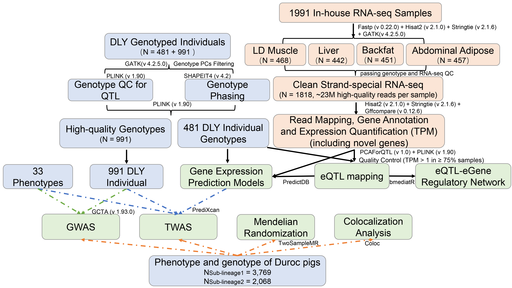

# Swine Genotype Expression Phenotype (SGEP)

## Overview

This repository contains the scripts and workflow used in our study to integrate genotype, gene expression, and phenotype data in swine, enabling downstream association analyses between genetic variation, transcriptomic regulation, and phenotypic traits.

The pipeline includes data preprocessing, expression quantification, and genotype–expression–phenotype association analyses, as described in the accompanying manuscript.

## Pipeline Overview
The following diagram illustrates the overall pipeline of the project, including data preprocessing and core processing logic.




## Overview of statistical analyses

- Data preprocessing and quality control

  - Genotype data

  - RNA-seq data

- Genotype–expression association analyses
      - eQTL mapping and functional characterization analysis
     - Tissue sharing patterns

-  Expression-mediated genetic effects

  -  Mediation analysis
  -  Pathway analysis

- Genotype–phenotype association analyses
  - Genome-Wide Association Study (GWAS)
  - Enrichment analysis of eQTLs within GWAS QTLs

  - Transcriptome-wide association study (TWAS)

- Causal inference and colocalization analyses
  - Mendelian randomization
  - Colocalization analysis
    

## Individual-level PrediXcan Analysis Using Pig TWAS Prediction Models

We provide the necessary shell scripts and corresponding data to facilitate the use of pre-built pig PrediXcan prediction models for transcriptome-wide association studies (TWAS).


### Model Description

These prediction models were trained using pig eQTL data based on the [PredictDB](https://github.com/hakyimlab/PredictDB-Tutorial) framework.

- Species: Sus scrofa
- Genome assembly: Sscrofa11.1
- Model type: Elastic Net
- Tissues:
  - Muscle (Mu)
  - Liver (Li)
  - Abdominal adipose (AF)
  - Backfat (BF)
    

### Prerequisites

Ensure you have Python 3.7 or higher. Set up a Python environment following the requirements of [MetaXcan](https://github.com/hakyimlab/MetaXcan):

numpy
scipy
pandas
statsmodels
patsy
h5py
cyvcf2
bgen_reader

You can also download the PrediXcanAssociation.py and Predict.py scripts from the [Association_study folder](https://github.com/jieeewu/swine-genotype-expression-phenotype/tree/main/05_Association_study) or [MetaXcan](https://github.com/hakyimlab/MetaXcan).

### Input Files

1. **Predictive Models**: Download the corresponding tissue-specific `*.db` files in the [Tissue_DB](Tissue_DB/) folder (`${tissue}_models.db`). These `*.db` files are obtained using the [PredictDB tutorial](https://github.com/hakyimlab/PredictDB-Tutorial).Each database contains SNP weights for predicting genetically regulated gene expression in a specific tissue.
2. **Genotype Files**: Phased genotype files in VCF format,generated from WGS or imputed genotype data (imputation server：[SWIM](http://106.13.12.181:9088/#/home)). Variant IDs must match the identifiers used in the prediction models. The SNP ID format should be `chrom_position_ref` (e.g., `1_502855_C`; Sscrofa11.1).
3. **Phenotype Files**: `phenotype_name.list` and `${phenos_file}`. The phenotype file should contain FID, IID, and phenotype columns (e.g., pheno1, pheno2, etc.)

### Output Files

1. `${tissue}_prediction_output.txt`: Individual-level genetically predicted gene expression matrix.
2. 2. `${tissue}_prediction_summary_output.txt`: Prediction performance information including number of SNPs used for each gene.
3. `${tissue}_${pheno}_association.txt`: Association between genetically predicted expression and phenotype.

### Running the Shell Script

```bash
# Mu: Muscle
# Li: Liver
# AF: Abdominal adipose
# BF: Backfat

module load GCCcore/8.2.0 Python/3.7.2
mkdir -p ${Predixcan}/Predict_output ${Predixcan}/PrediXcanAssociation 

for tissue in Mu Li AF BF 
do
printf "Predict expression\n\n"
python3 $METAXCAN/Predict.py \
--model_db_path $db/${tissue}_models.db \
--vcf_genotypes ${tissue}_phased_for_Predixcan.vcf.gz \
--vcf_mode genotyped \
--prediction_output ${Predixcan}/Predict_output/${tissue}_prediction_output.txt \
--prediction_summary_output ${Predixcan}/Predict_output/${tissue}_prediction_summary_output.txt \
--verbosity 9 \
--throw

printf "association\n\n"
mkdir -p ${Predixcan}/PrediXcanAssociation/${tissue}

for pheno in `cat phenotype_name.list`
do
python3 $METAXCAN/PrediXcanAssociation.py \
--expression_file ${Predixcan}/Predict_output/${tissue}_prediction_output.txt \
--input_phenos_file ${phenos_file} \
--input_phenos_column $pheno \
--output ${Predixcan}/PrediXcanAssociation/${tissue}/${tissue}_${pheno}_association.txt \
--verbosity 9 \
--throw
done
done


```

## Code Availability

The source code is available at:
https://github.com/jieeewu/swine-genotype-expression-phenotype

A versioned release of the code used in this study has been archived in Zenodo
and assigned a DOI: https://doi.org/10.5281/zenodo.22275711

## Citation

If you use this pipeline or code in your work, please cite our manuscript and the archived code:

- **Publication:**.
Jie Wu*, Ming Yang*, Zebin Zhang*, Enqin Zheng*, Zhanwei Zhuang, Shenping Zhou, Cineng Xu, Yibin Qiu, Donglin Ruan, Jianping Quan, Rongrong Ding, ..., Wen Huang#, Jie Yang#, Zhenfang Wu#. *Integrative Systems Genetics Analysis Advances Elucidation of the Genetic Basis of Complex Traits in Pigs*. *Nature Communications* (Accepted).
- **Code Archive:**
  [Zenodo DOI: https://doi.org/10.5281/zenodo.22275711]

------

## Contact

For questions or issues regarding the pipeline, please open an issue in this repository or contact the corresponding author.


